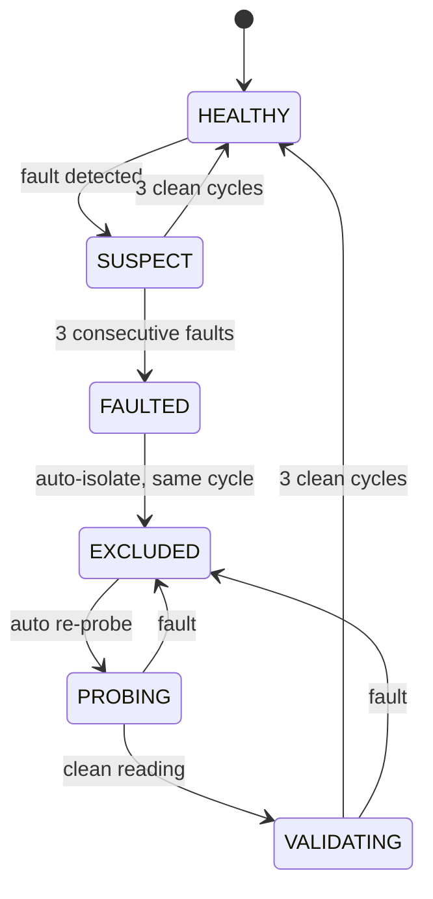

# QNX Assist Parking

### Real-Time Sensor Fault Detection, Isolation & Recovery on QNX Neutrino 8.0


> A parking-assist prototype that **doesn't trust its sensors blindly.**
> Redundant ultrasonic sensors and IMUs are continuously checked for four classes
> of fault. A bad sensor is isolated in the same cycle it is confirmed faulty, the
> application degrades gracefully, and when the last valid range is gone the system
> says **UNSAFE** rather than inventing a distance.

---

## At a Glance

| | Result | Evidence |
|---|---|---|
| **Worst-case FDI execution** | **289 µs** against a **5,000 µs** per-cycle budget | Measured, 500 cycles |
| **Deadline misses** | **0 / 500** | Measured |
| **Budget consumed (worst case)** | **5.78 %** — about **17× headroom** | Derived |
| **Average FDI execution** | **63 µs** (1.3 % of budget) | Measured |
| **Fault detect → isolate** | **Same cycle** (Δ = 0 µs); ~222 ms from onset for ultrasonic, ~224 ms for IMU | Measured |
| **Fault classes** | Stuck-at · Stale/Delayed · Noisy · Contradictory | Source-verified |
| **Degradation ladder** | `FULL → DEGRADED/SINGLE → DEGRADED/HOLDOVER → UNSAFE` | Observed in live run |
| **System load during trace** | 98.9 % idle across 4 cores (3 s System Profiler capture) | Measured |

---

## Why This Is Interesting on QNX

Sensor failures are rarely clean. A sensor that is *stuck, stale, noisy or in disagreement with its twin* still produces plausible-looking numbers, and a plausible wrong number is more dangerous than no number.

This project shows that a full **detect → classify → isolate → recover → degrade** pipeline can run on a QNX RTOS with a **worst-case cost of 289 µs**, using native microkernel primitives rather than polling or shared state:

- **Event-driven acquisition.** Ultrasonic echo edges arrive as QNX **pulses** on a private channel (`ChannelCreate(_NTO_CHF_PRIVATE)` → `ConnectAttach` → `MsgReceivePulse`) bounded by `TimerTimeout`. The acquisition thread *blocks* instead of spinning on a GPIO register, yet still resolves a microsecond-scale pulse width.
- **Priority-ordered tasks.** `SCHED_FIFO` with fault detection (25) > recovery (20) > sensor/fusion (15) > logging (5), so best-effort logging can never preempt fault handling.
- **Bounded data path.** A static, fixed-size 10-sample circular history per sensor, with no dynamic allocation, so per-cycle work has a hard upper bound.
- **Direct hardware access from user space.** MPU6050 over I²C via `devctl()` / `DCMD_I2C_SENDRECV`; HC-SR04 over GPIO; timestamps from `clock_gettime()`.
- **Observability.** Validated with the **QNX System Profiler** (`.kev` trace) alongside in-application timing instrumentation.

---

## System Architecture

```text
   HC-SR04 ×2 (GPIO)                    MPU6050 ×2 (I²C, 0x68 / 0x69)
   echo edges → QNX pulses              devctl / DCMD_I2C_SENDRECV
          │                                        │
          └──────────────┬─────────────────────────┘
                         ▼
              ┌───────────────────────┐
              │  Sensor + Fusion      │  prio 15   acquire · timestamp · fuse
              └──────────┬────────────┘
                         │  sensor_sample_t  (value[] + value_count)
                         ▼
              ┌───────────────────────┐
              │  Circular history     │  10 samples / sensor, static, no malloc
              └──────────┬────────────┘
                         ▼
              ┌───────────────────────┐
              │  Fault Detector       │  prio 25   4 checks + state machine
              └───────┬───────┬───────┘
                      │       │
        recovery cmd  │       │  log events
                      ▼       ▼
              ┌────────────┐  ┌────────────┐
              │ Recovery   │  │  Logger    │
              │ prio 20    │  │  prio 5    │
              └────────────┘  └─────┬──────┘
                                    ▼
                         /tmp/fault_timeline.log
```

Tasks communicate through message queues (`/mq_sensor_data`, `/mq_recovery_cmd`, `/mq_recovery_result`, `/mq_log_events`), which keeps each stage's responsibility and failure domain separate.

| Task | Role | Scheduling | Priority |
|---|---|---|---|
| Fault Detector | Detect, classify, drive state machine | `SCHED_FIFO` | **25** |
| Recovery | Probe, validate, reintegrate | `SCHED_FIFO` | **20** |
| Sensor + Fusion | Acquire, timestamp, fuse | `SCHED_FIFO` | **15** |
| Logger | Fault timeline, best-effort | `SCHED_FIFO` | **5** |

*Rationale:* a slow or blocked recovery probe must never delay classification of a fault already in flight, and logging must never preempt anything safety-relevant.

---

## One Detection Engine, Two Sensor Types

`fdi_detect()` is a single generic engine. Because every sample carries `value[]` and `value_count`, **the same code path serves 1-value ultrasonic sensors and 6-value IMUs**. Only the thresholds differ. Checks run in a fixed order and return the first fault found.

| Fault | Rule | Ultrasonic | IMU |
|---|---|---|---|
| **Delayed / Stale** | Time since last sample exceeds timeout (or no sample ever received) | 500 ms | 500 ms |
| **Stuck-at** | Over a full 10-sample window, every component's (max − min) is below threshold | 0.5 cm | 0.01 g / 0.01 °/s |
| **Noisy** | Over a full 10-sample window, any component's (max − min) exceeds threshold | 30 cm | 5 g / 5 °/s |
| **Contradictory** | Euclidean distance to the redundant partner's latest sample exceeds threshold | 70 cm | 5 (vector distance, tunable) |

**Debounce:** three consecutive detections are required to escalate, and three consecutive clean cycles to de-escalate, so a single glitch does not exclude a healthy sensor.

### Per-Sensor State Machine



Isolation is automatic: an excluded sensor is removed from fusion the same cycle it is marked faulty, with no external command. The measured timeline confirms it: for every sensor, **isolate time equals detect time**.

---

## Graceful Degradation, Captured Live

The application changes behaviour as sensors are lost. This is a trimmed excerpt from a real run on the Raspberry Pi 5 (an object was brought steadily closer to the ultrasonic pair):

```text
[PARKING] dist=22.7cm (+/-1.7)  zone=SLOW           mode=FULL                 src=2
[FDI] US1=HEALTHY  US2=HEALTHY  IMU1=HEALTHY IMU2=HEALTHY
   ...
[PARKING] dist=10.1cm (+/-1.7)  zone=CRITICAL/STOP  mode=FULL                 src=2
[FDI] US1=HEALTHY  US2=HEALTHY  IMU1=HEALTHY IMU2=HEALTHY
[PARKING] dist=11.0cm (+/-2.2)  zone=CRITICAL/STOP  mode=FULL                 src=2
[FDI] US1=SUSPECT  US2=SUSPECT  IMU1=HEALTHY IMU2=HEALTHY
[PARKING] dist=10.8cm (+/-15.0) zone=CRITICAL/STOP  mode=DEGRADED/SINGLE      src=1
[FDI] US1=EXCLUDED US2=SUSPECT  IMU1=HEALTHY IMU2=HEALTHY
[PARKING] dist=12.8cm (+/-4.8)  zone=CRITICAL/STOP  mode=DEGRADED/HOLDOVER    src=0
[FDI] US1=EXCLUDED US2=EXCLUDED IMU1=HEALTHY IMU2=HEALTHY
[PARKING] dist=12.8cm (+/-38.5) zone=CRITICAL/STOP  mode=DEGRADED/HOLDOVER    src=0
[PARKING] NO VALID RANGE        zone=CRITICAL/STOP  mode=UNSAFE               held=1.6s
```

| Stage | Sensors available | Behaviour |
|---|---|---|
| **FULL** | US1 + US2 | Fused distance from both sensors |
| **DEGRADED / SINGLE** | one ultrasonic sensor | Continues on the survivor; uncertainty widens to ±15 cm |
| **DEGRADED / HOLDOVER** | none | Last good distance (12.8 cm) is held, and its **uncertainty grows ≈2.8 cm every cycle** |
| **UNSAFE** | none | After ≈1.6 s of holdover, reports `NO VALID RANGE` instead of a stale number |

Two design choices stand out. The reported **±uncertainty** tells the consumer how much to trust the number as evidence ages. And the explicit **UNSAFE** state gives braking and warning logic something it can act on, which a plausible-but-wrong distance would not.

Later in the same run both IMUs also failed (`SUSPECT` at ~16.3 s, `EXCLUDED` at ~16.7 s), and the system correctly held `UNSAFE` with all four sensors excluded through the end of the trace (56.6 s).

---

## Real-Time Results

All figures below come from the application's built-in `FDI REAL-TIME METRICS` reporting, taken from five consecutive checkpoints of one continuous run.

### FDI execution time vs. deadline

| Cycles | Min (µs) | Avg (µs) | Max / WCET (µs) | Deadline (µs) | Misses |
|---:|---:|---:|---:|---:|---:|
| 100 | 33 | 56 | 235 | 5,000 | **0** |
| 200 | 33 | 59 | 289 | 5,000 | **0** |
| 300 | 33 | 61 | 289 | 5,000 | **0** |
| 400 | 33 | 63 | 289 | 5,000 | **0** |
| 500 | 33 | 63 | 289 | 5,000 | **0** |

```text
Deadline            ████████████████████████████████████████  5000 µs
Worst case (289 µs) ██▎                                        5.78 %
Average    (63 µs)  ▌                                          1.26 %
```

- **Worst-case utilization:** 289 / 5000 = **5.78 %**
- **Remaining margin:** 5000 − 289 = **4,711 µs**
- The maximum **plateaued at 289 µs from cycle 200 onward** and did not grow over the next 300 cycles, including through the period where all four sensors were being excluded.

> The 289 µs figure is the maximum *observed* over 500 cycles of one run. It is not a formally derived or certified WCET.

### How the 5 ms deadline is met

The margin is a consequence of design decisions, not tuning:

1. **Fixed-size, allocation-free history.** A static 10-slot circular buffer per sensor means no `malloc`, no unbounded growth and no allocator jitter in the hot path.
2. **Constant-shape detection.** Four checks, always in the same order, over a window of at most 10 samples. Per-cycle work is bounded by construction.
3. **One engine, no per-sensor special cases.** The generic `value[]` / `value_count` design avoids extra code paths in the timing-critical loop.
4. **Blocking, event-driven acquisition.** Echo timing uses `MsgReceivePulse` bounded by `TimerTimeout`, so acquisition neither burns CPU nor can block detection indefinitely.
5. **Priority separation.** Detection runs at the highest application priority, recovery below it, logging lowest, so slow probes and I/O do not interfere with classification.
6. **Debounced state machine.** Confirmation counters keep the common path cheap and stop transient glitches from triggering isolation and recovery work.
7. **Auto-isolation in the same cycle.** No extra round-trip is needed to remove a faulty sensor from fusion.

### Fault response latency

| Sensor | Transitions | Detect | Isolate |
|---|---:|---:|---:|
| US1 | 1 | 221.944 ms | 221.944 ms |
| US2 | 1 | 222.110 ms | 222.110 ms |
| IMU1 | 1 | 224.002 ms | 224.002 ms |
| IMU2 | 1 | 224.002 ms | 224.002 ms |

### QNX System Profiler

A 3-second `.kev` trace of the running system:

| Metric | Value |
|---|---:|
| Trace duration | 3.000 s |
| CPUs | 4 |
| Total events | 154,872 |
| Dropped buffers | **0** |
| Idle | **98.9 %** |
| User | 0.3 % |
| Kernel | 0.8 % |

> These are whole-system figures for the capture window, not the isolated CPU use of `assist_parking`. The 5.78 % above is the FDI task's own share of its 5 ms budget, a different measurement.

### Sampling-loop timing

The sensor/fusion loop is configured for a 100 ms (10 Hz) period. Measured deviation from nominal was **10.99 ms minimum, 14.00 ms maximum, ≈11.9 ms average**. Every cycle deviated by a similar amount, so the spread is only about 3 ms. That pattern looks like a fixed per-cycle overhead (sleep-based period plus sensor acquisition time) rather than random scheduling noise, and root-causing it is on the roadmap below. This is separate from FDI execution time, which stayed under 289 µs.

---

## Engineering Decisions

- **Acquisition left untouched.** The proven GPIO/I²C timing, edge detection and register handling were preserved. The ultrasonic driver is unmodified; the IMU driver was restructured into callable functions with identical register addresses, calibration math and conversion constants (16384 LSB/g, 131 LSB/(°/s)).
- **Simplified the data path.** An early shared-memory-plus-mutex design added synchronization complexity for no benefit. Replacing it with a small bounded history buffer made the path easier to reason about and to time.
- **Detection and recovery are separate responsibilities.** The detector identifies faults; recovery performs bounded probing and reports back.
- **Calibration first.** Redundant sensors do not produce identical numbers, so each IMU is identified and calibrated independently at start-up:

```text
Sensor 0x68 WHO_AM_I = 0x70
Sensor 0x69 WHO_AM_I = 0x68
[CALIB] Done 0x68 -> Accel Offsets (g)     | X:  0.008 | Y: -0.014 | Z:  0.006
[CALIB] Done 0x68 -> Gyro Offsets (deg/s)  | X: -0.615 | Y:  4.161 | Z: -1.575
[CALIB] Done 0x69 -> Accel Offsets (g)     | X:  0.077 | Y:  0.015 | Z:  0.195
[CALIB] Done 0x69 -> Gyro Offsets (deg/s)  | X: -0.525 | Y: -0.293 | Z:  0.523
```

---

## Hardware & Software

| | |
|---|---|
| **Compute** | Raspberry Pi 5 (AArch64) |
| **Ultrasonic** | 2 × HC-SR04, GPIO trigger/echo |
| **IMU** | 2 × MPU6050 on shared I²C bus (`/dev/i2c1`, addresses 0x68 / 0x69) |
| **OS** | QNX Neutrino RTOS 8.0 |
| **Toolchain** | QNX Momentics IDE, `qcc` (`gcc_ntoaarch64le`), C |
| **QNX / POSIX APIs** | `ChannelCreate`, `ConnectAttach`, `MsgReceivePulse`, `TimerTimeout`, `devctl`, `clock_gettime`, `pthread`, `SCHED_FIFO`, POSIX message queues |
| **Analysis** | QNX System Profiler, on-target FDI metrics, fault timeline log |

### Source layout

```text
assist_parking/
├── src/
│   ├── main.c               # loop, evaluation, parking decision, status output
│   ├── sensor_manager.c     # single hand-off point from drivers to buffers
│   ├── sensor_buffer.c      # 10-sample circular history per sensor
│   ├── fault_detection.c    # fdi_detect() + state machine
│   ├── ultrasonic_driver.c  # HC-SR04 via GPIO + QNX pulses
│   └── imu_driver.c         # MPU6050 via I²C devctl
├── include/                 # sensor_buffer.h, sensor_manager.h, fault_detection.h,
│                            # ultrasonic_driver.h, imu_driver.h, mq_names.h
└── Makefile
```

> Layout is logical and may differ slightly from the Momentics project configuration.

Fault events are written to `/tmp/fault_timeline.log` on the target, giving an auditable sequence of every state transition.

---

## Scope, Limitations & Roadmap

This is a **functional real-time prototype**, not a production safety system. No ISO 26262 / ASIL certification is claimed. Known gaps are listed openly:

| Area | Current status | Next step |
|---|---|---|
| **Recovery end to end** | PROBING → VALIDATING → HEALTHY is implemented, but the recorded run never cleared its faults, so no reintegration was observed (recover = 0 µs) | Controlled test: remove the fault condition and measure probe → validate → reintegrate latency |
| **IMU identification** | `WHO_AM_I` returned `0x70` / `0x68`; initialization does not gate on it | Investigate wiring / address strap / part variant; raise it as a start-up warning |
| **Loop-period offset** | ≈11.9 ms average deviation on a 100 ms period (see above) | Confirm `SCHED_FIFO` priority and contending work; trace with System Profiler |
| **WCET** | 289 µs is observed, not certified | Longer runs, stress and fault-injection campaigns, formal analysis |
| **Fault test coverage** | One continuous live run with mixed conditions | Isolated single-fault-type test cases |

**Beyond the prototype:** functional (cross-modality) redundancy, CAN-FD and automotive-grade sensors, N-modular redundancy, plausibility cross-checks, hardware-in-the-loop fault injection as an on-ramp to ASIL-B, persistent fault storage, and a sensor-health dashboard.

---

## Conclusion

```text
Don't just detect the failure.

Detect it.  Classify it.  Isolate it.  Try to recover it.
Keep the vehicle function running on what remains healthy.
And when nothing trustworthy is left, say so.
```

Fault-tolerant sensing, running on QNX, in **289 µs worst case against a 5 ms budget, with zero deadline misses.**

---

## License

Add the project's applicable license here.
